### DELL-XPS-15-9570-8950-4K-macOS-Mojave
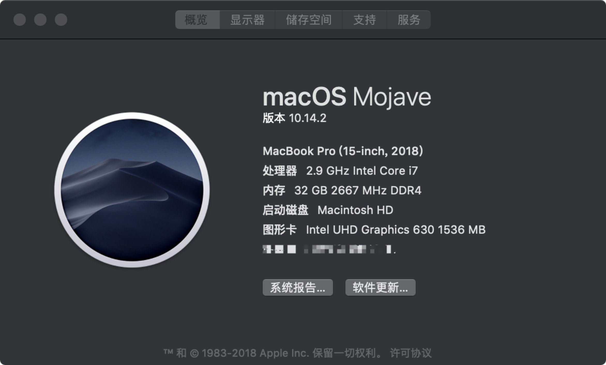
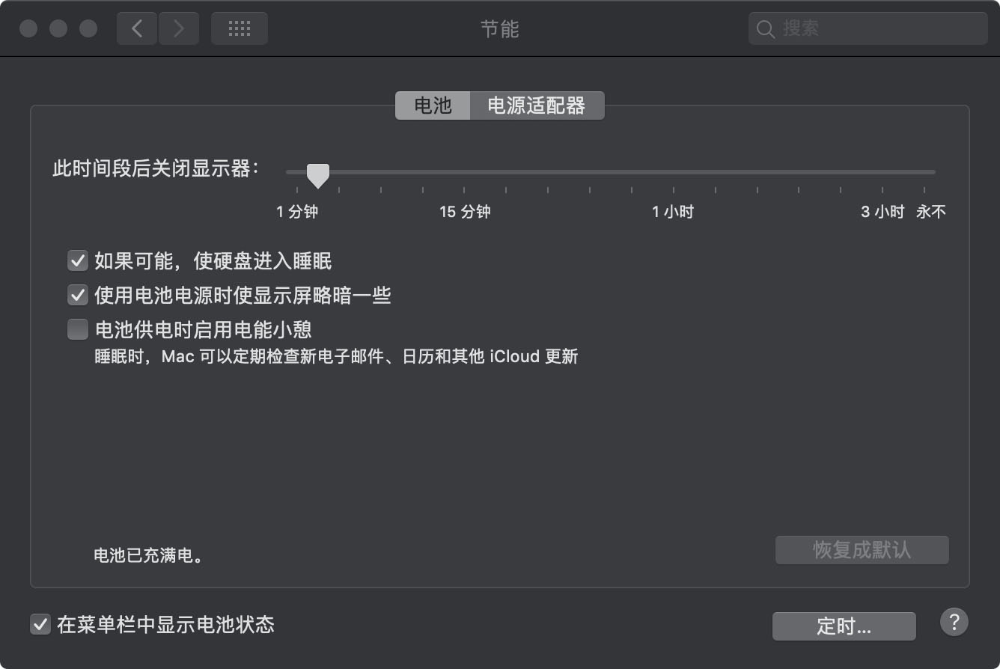
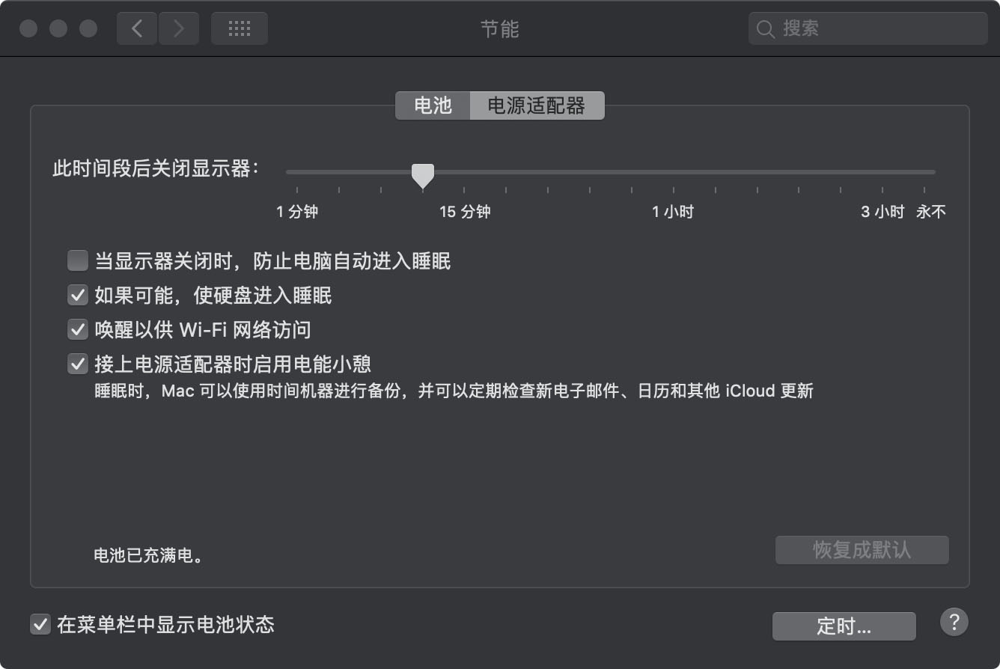
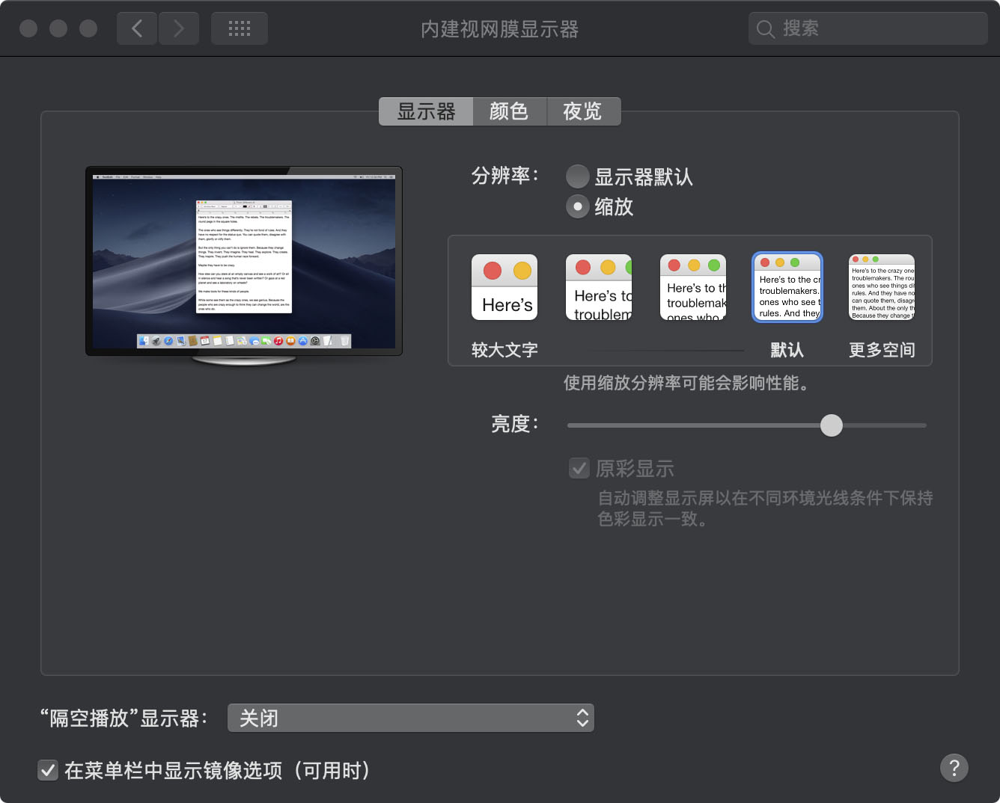
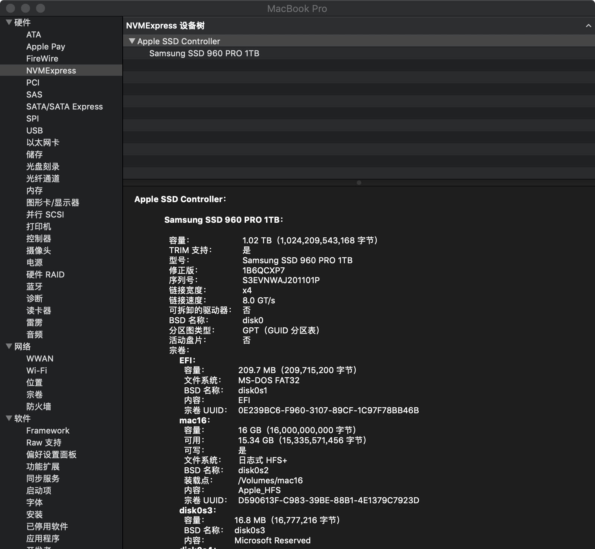
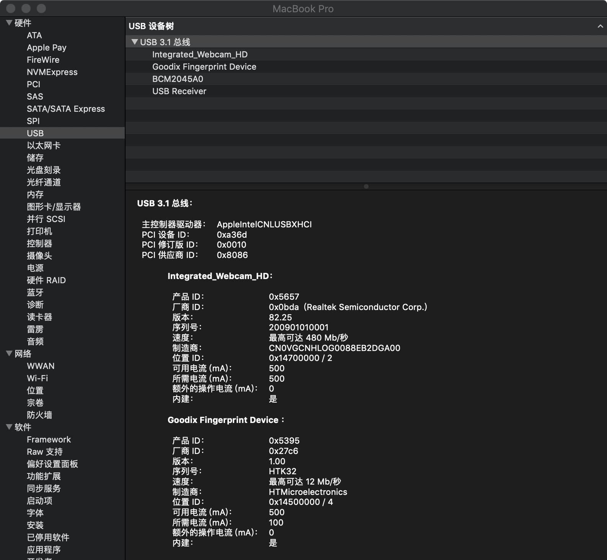
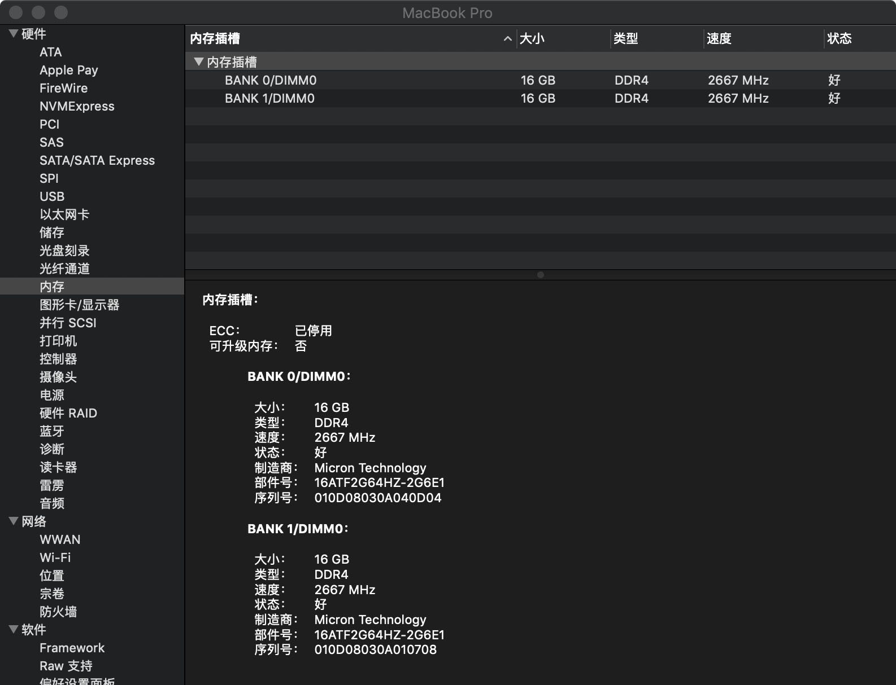
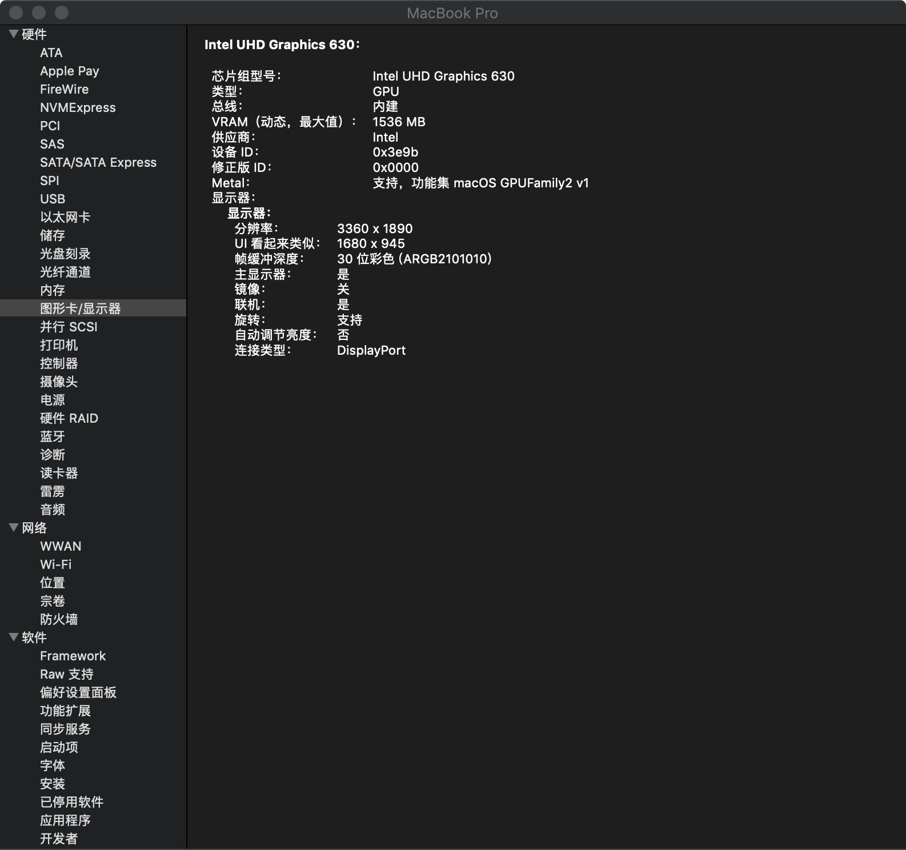
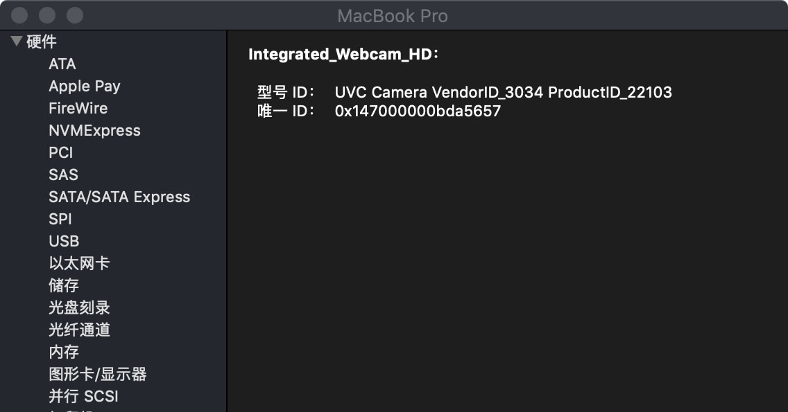

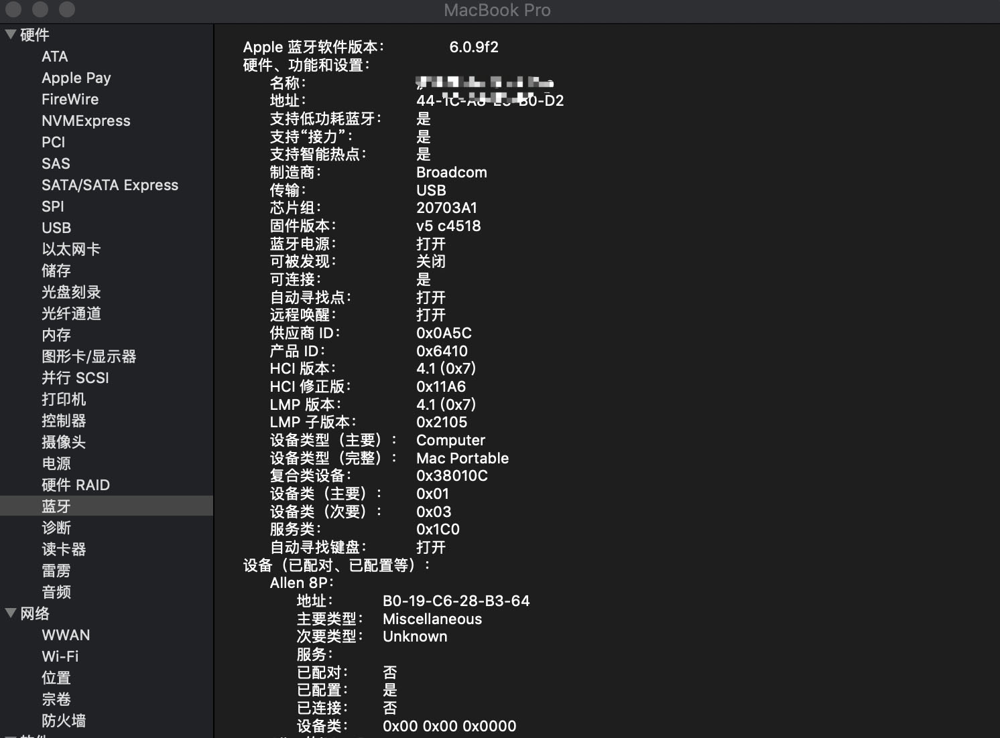
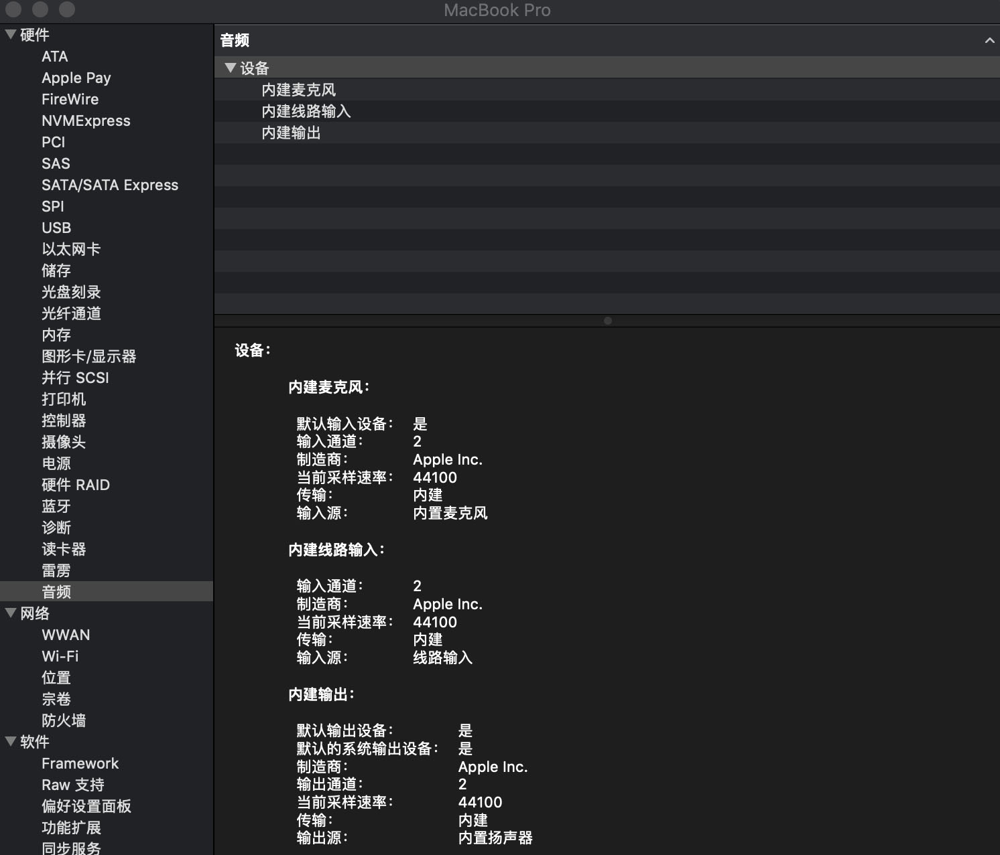

## 全新安装10.14.2

      系统安装：1.使用macOS-Mojave OSInstaller 安装，重启进入系统
      系统驱动：2.重建kextcache(sudo kextcache -i /) 
               3.替换DELL XPS 15 9570 8950 4K macOS Mojave EFI文件夹
               4.重启

## 设备
      uhd display 630
      8950HK
      DDR432GB Ram、
      杀手网卡不工作替换DW1830
      PM981 1TB不能正常工作，替换PRO960 1TB
     

## 工作
      显卡正常：Intel Graphics accelleration(uhd630)		
      无线蓝牙正常：wifi & bluetooth (dw1830)
      声卡正常：Audio （13、30）
      摄像头：正在工作
      屏幕亮度：brightlight control（需要键盘设置 F11、F12）
      睡眠：sleep正常（盒盖正常）
      显示器：Retina正常
      触摸屏：正常驱动
      触控板：开启手势

## 不工作（需要解决的问题）
      HDMI 外屏输出会直接重启
      SD读卡器硬件设备不认，无法正常工作
      雷劈3设备里面没正确识别（没有设备测试是否能正常工作）
      电池容量识别82瓦，实际电池容量为95瓦。（容量没有正确识别）

## 感谢
      为Hackintosh做的驱动设备大神们（这就不列举）
      感谢FireWolf Pl解决的零恐慌问题
      特别感谢身边的好友们，少华、官人、火腿肠、涛哥、大表哥、黑果小兵等兄弟们的帮助！
      
## 希望更多使用XPS15 9570 的兄弟姐妹们来一起完善Hackintosh
