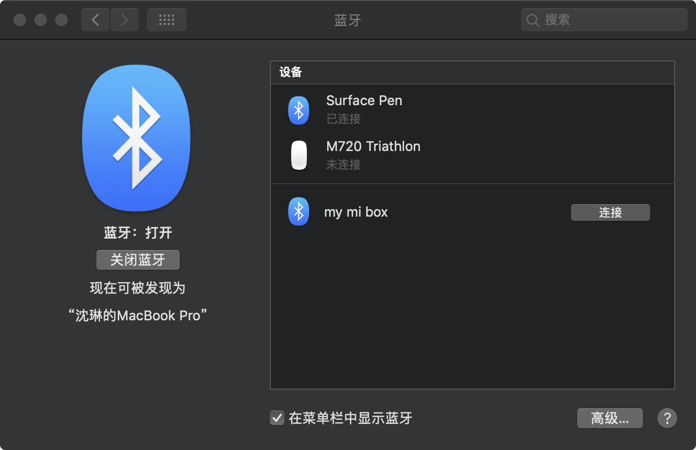
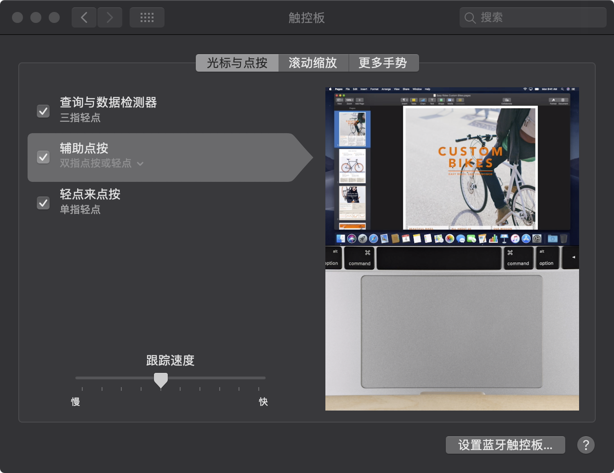
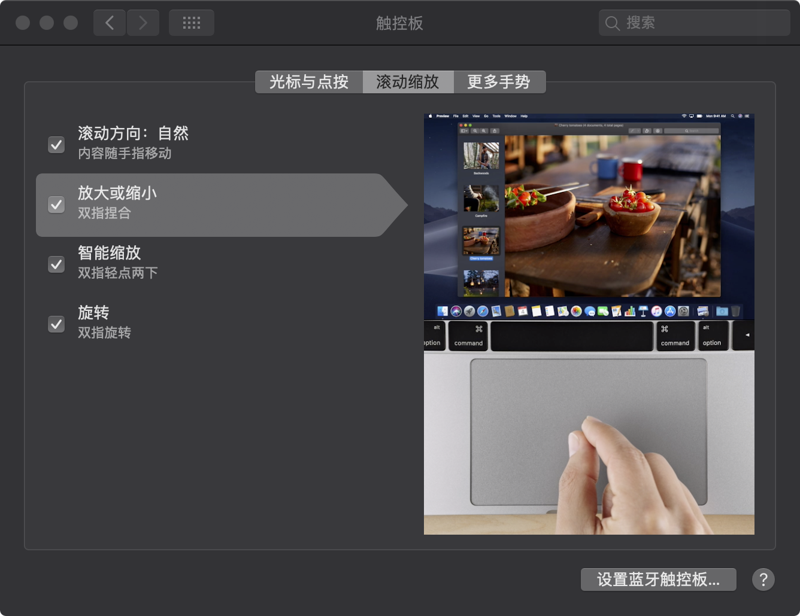
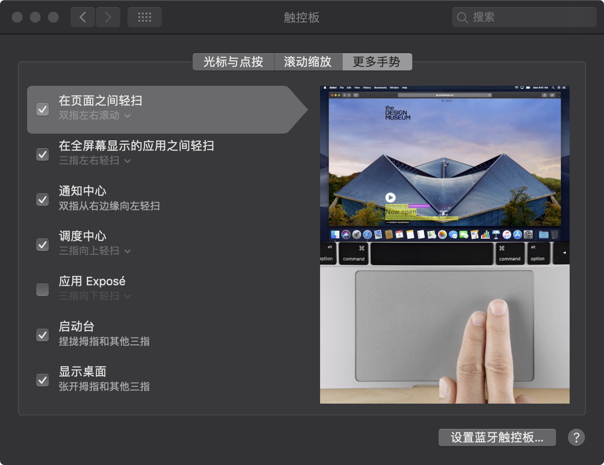

### DELL-XPS-15-9570-8950-4K-macOS-Mojave

## 全新安装10.14.2 . System Installation: 
      系统安装：1.使用macOS-Mojave OSInstaller 安装，重启进入系统
      系统驱动：2.重建kextcache(sudo kextcache -i /) 
              3.替换DELL XPS 15 9570 8950 4K macOS Mojave EFI文件夹
              4.重启
      1. Use macOS-Mojave OS Installer to install and restart to enter the system
      2. Reconstruct kextcache (sudo kextcache-i/)
      3. Replace the DELL XPS 15 9570 8950 4K macOS Mojave EFI folder
      4. restart
## 设备
      uhd display 630
      8950HK
      DDR432GB Ram、
      杀手网卡不工作替换DW1830
      Killer Network Card does not work instead of DW1830
      PM981 1TB不能正常工作，替换PRO960 1TB,
      PM981 1TB does not work properly. Replace PRO9601 T

## 工作 Work in the army
      显卡正常：Intel Graphics accelleration(uhd630)		
      无线蓝牙正常：wifi & bluetooth (dw1830)
      声卡正常：Audio （13、30）
      摄像头：正常工作
      屏幕亮度：brightlight control（需要键盘设置 F11、F12）
      睡眠：sleep正常（盒盖正常）
      显示器：Retina正常
      触摸屏：正常驱动
      触控板：开启手势
      Video card normal: Intel Graphics accellation (uhd630)
      Wireless Bluetooth Normal: Wifi & Bluetooth (dw1830)
      Sound Card Normal: Audio (13, 30)
      Camera: working normally
      Screen brightness: brightlight control (need keyboard setting F11, F12)
      Sleep: Sleep is normal (cover is normal)
      Display: Retina is normal
      Touch Screen: Normal Drive
      Touch board: Open gesture

## 不工作（需要解决的问题）Not working (problem to be solved)
      HDMI 外屏输出会直接重启
      1050TI显卡使用ssdt屏蔽（macOS-Mojave系统下无法驱动）
      SD读卡器硬件设备不认，无法正常工作
      雷劈3设备里面没正确识别（没有设备测试是否能正常工作）
      电池容量识别82瓦，实际电池容量为95瓦。（容量没有正确识别）
      HDMI Outside Screen Output will be restarted directly
      1050TI graphics cards use SSDT shielding (can not be driven under macOS-Mojave system)
      The hardware of SD card reader is not recognized and can not work properly.
      Lightning splitting 3 equipment is not correctly identified (no equipment testing can work properly)
      Battery capacity identification 82 watts, the actual battery capacity is 95 watts. (Capacity is not correctly identified)

## 感谢 Thank you.
      为Hackintosh做设备驱动的大神们（这就不一一列举，感谢有你们）
      感谢FireWolf Pl解决的零恐慌问题，和一直在完善xps15 9570
      特别感谢身边的好友们给予的帮助，少华、官人、火腿肠、涛哥、大表哥、黑果小兵等兄弟们！
      Making device-driven gods for Hackintosh (this is not a list, thank you all)
      Thanks to FireWolf Pl for solving the zero panic problem and improving xps15 9570
      Thank you very much for your help. Shaohua, officials, ham sausage, Taoge, Big Cousin, Daliansky and other brothers!
      
## 希望更多使用XPS15 9570 的兄弟姐妹们来一起完善Hackintosh
## Hope to use XPS 15 9570 brothers and sisters to improve Hackintosh
